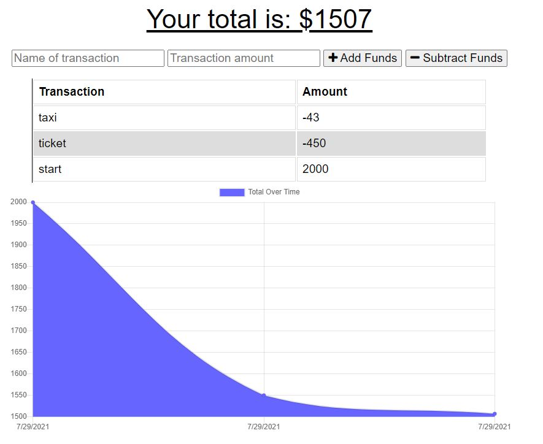
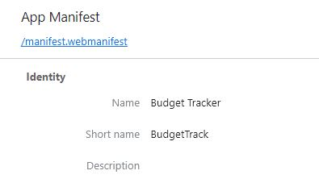

# Budget Tracker Application with Offline Logging


## Description

Link to App: https://brownnicholasj-budget-tracker.herokuapp.com/

- This Budget Tracker was developed to allow a user that travels, keep track of
  their finances, even when no access online (offline access).
- The technology used for this application are: node, javascript, express
  (npm),mongoose (npm), morgan (npm), lite-server (npm), MongoDB, Heroku
- The biggest challenge with this project was managing the service worker and
  version control. I had a lot of new code not take because I either did not
  unregister the service worker or did not update the version, thus making the
  new information not to be installed.

## Table of Contents

- [Installation](#installation)
- [Usage](#usage)
- [License](#license)
- [Contributing](#contributing)
- [Behind The Code](#behind-the-code)
- [Questions](#questions)

## Installation

To install necessary dependencies, run the following command:

```
npm i
```

The following dependencies will be installed:

- express
- mongoose
- morgan
- lite-server

## Usage

A user will go to the page at
https://brownnicholasj-budget-tracker.herokuapp.com/ and see the landing page
with the current balance 

- The user can add a new transaction name and transaction amount, then push the
  '+Add Funds' or '-Subtract Funds' to submit the transaction.

- The transaction will post to the graph and the graph will adjust with the
  inputs that come in.

If the user does NOT have online access, the Page will load with a
manifest.webmanifest 

## License

This project is licensed under the MIT license.

## Contributing

A thanks to the following contributors to this project:

- 2021 Trilogy Education Services, LLC
- Nicholas Brown (brownnicholasj.dev@gmail.com)

### Behind the Code

As the front end of the code was 'provided' by Trilogy Education Services, this
review will be focused on the back end code, specifically the routes and
interaction with the MongoDB.

- The routes were created using express.router and stored on two javascript
  files (api.js and views.js) <br> 

- The 'views' routes are handling sending the HTML pages to display the correct
  UI to the user as they traverse the application: <br>
  

- The 'api' routes are handling the data requests from the database with MongoBD

  - Showing in four sections, the first is the constants that are created to
    house the requirements for the api.js
    
  - The second section are the list of 'POST' actions to save data to the
    database. This handles when a user 'creates' a new workout or saves a new
    exercise to a workout. 
    - the '/workouts/range' was kept in to accept an integration file to import
      more than one entry at a time
  - The third section is the 'PUT' action, which will find a specific workout by
    looking up the mongoDB ObjectID (utilizing Mongojs)
    
  - The last section is the 'GET' actions, which will display the data. This is
    utilizing the aggregate property defined in section 1 in order to add fields
    and summarize the duration of all of the exercises in a workout.
    

## Questions

If you have any questions about the repo, open an issue or contact me directly
at brownnicholasj.dev@gmail.com.You can find more of my work at
[brownnicholasj](https://github.com/brownnicholasj/).
