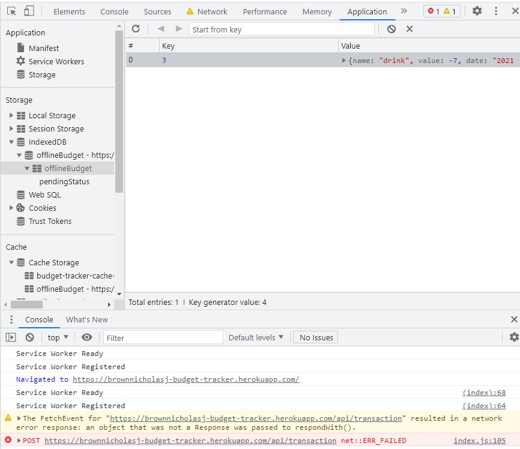

# Budget Tracker Application with Offline Logging


## Description

Link to App: https://brownnicholasj-budget-tracker.herokuapp.com/

- This Budget Tracker was developed to allow a user that travels, keep track of
  their finances, even when no access online (offline access).
- The technology used for this application are: node, javascript, express
  (npm),mongoose (npm), morgan (npm), lite-server (npm), MongoDB, Heroku
- The biggest challenge with this project was managing the service worker and
  version control. I had a lot of new code not take because I either did not
  unregister the service worker or did not update the version, thus making the
  new information not to be installed.

## Table of Contents

- [Installation](#installation)
- [Usage](#usage)
- [License](#license)
- [Contributing](#contributing)
- [Questions](#questions)

## Installation

To install necessary dependencies, run the following command:

```
npm i
```

The following dependencies will be installed:

- express
- mongoose
- morgan
- lite-server

## Usage

A user will go to the page at
https://brownnicholasj-budget-tracker.herokuapp.com/ and see the landing page
with the current balance 

- The user can add a new transaction name and transaction amount, then push the
  '+Add Funds' or '-Subtract Funds' to submit the transaction.

- The transaction will post to the graph and the graph will adjust with the
  inputs that come in.

If the user does NOT have online access, the Page will load with a
manifest.webmanifest 

The data to populate the app will be called from the cache


When entering data in an 'offline' status, data will be stored in the indexedDB


Upon coming back online, the service worker will take the data from indexedDB
and add to the MongoDB, which will also add to the cache.

The indexedDB will then be emptied to free up space and ready the indexedDB for
next possible offline entry.

## License

This project is licensed under the MIT license.

## Contributing

A thanks to the following contributors to this project:

- 2021 Trilogy Education Services, LLC
- Nicholas Brown (brownnicholasj.dev@gmail.com)

## Questions

If you have any questions about the repo, open an issue or contact me directly
at brownnicholasj.dev@gmail.com.You can find more of my work at
[brownnicholasj](https://github.com/brownnicholasj/).
